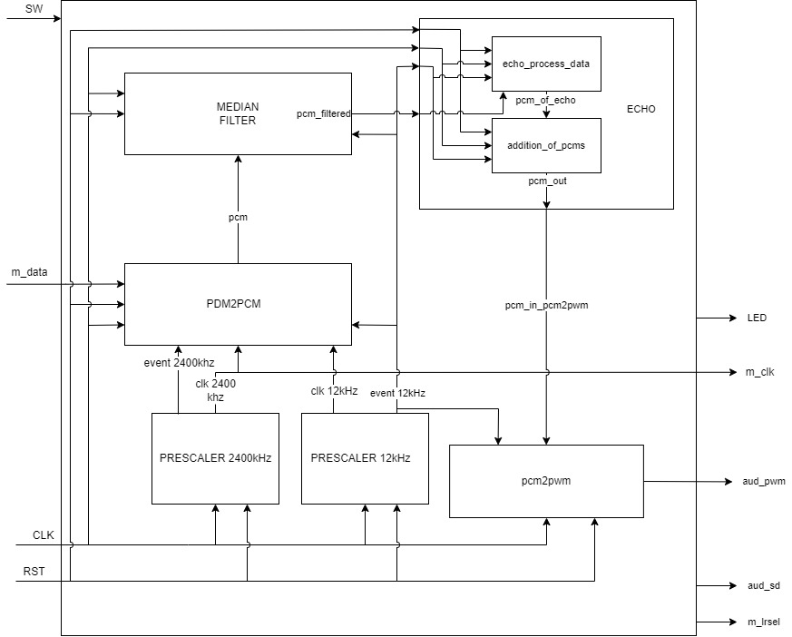

<a name="readme-top"></a>

[![Contributors][contributors-shield]][contributors-url]
[![Forks][forks-shield]][forks-url]
[![Stargazers][stars-shield]][stars-url]
[![Issues][issues-shield]][issues-url]
[![MIT License][license-shield]][license-url]
[![LinkedIn][linkedin-shield]][linkedin-url]


<!-- PROJECT LOGO -->
<br />
<div align="center">
  <a href="https://github.com/FallingLights/Audio-Processing-Artix-7">
    
  </a>

<h3 align="center">Realtime Audio Processing on Artix-7 FPGA</h3>
  <p align="center">
    Realtime audio processing on Artix-7 FPGA using VHDL, currently supports echo, reverb, and delay effects.
  </p>
</div>


<!-- TABLE OF CONTENTS -->
<details>
  <summary>Table of Contents</summary>
  <ol>
    <li>
      <a href="#about-the-project">About The Project</a>
      <ul>
        <li><a href="#built-with">Built With</a></li>
      </ul>
    </li>
    <li>
      <a href="#getting-started">Getting Started</a>
      <ul>
        <li><a href="#prerequisites">Prerequisites</a></li>
      </ul>
    </li>
    <li><a href="#usage">Usage</a></li>
    <li><a href="#contributing">Contributing</a></li>
    <li><a href="#license">License</a></li>
    <li><a href="#contact">Contact</a></li>
    <li><a href="#acknowledgments">Acknowledgments</a></li>
  </ol>
</details>


<!-- ABOUT THE PROJECT -->
## About The Project

<div align="center">
    
</div>

This project was created to demonstrate the capabilities of the Artix-7 FPGA at course Digital Design at University of Ljubljana FRI. The project uses the Digilent Nexys 4 DDR board, which has a Xilinx Artix-7 FPGA. The project uses the onboard audio codec to process audio in real time. The project currently supports echo, reverb, and delay effects. The project is written in VHDL and uses the Xilinx Vivado IDE.

<p align="right">(<a href="#readme-top">back to top</a>)</p>


### Built With

* [Vivado](https://www.xilinx.com/products/design-tools/vivado.html)
* [VHDL](https://en.wikipedia.org/wiki/VHDL)
* [Nexys 4 DDR](https://digilent.com/reference/programmable-logic/nexys-4-ddr/start)

<p align="right">(<a href="#readme-top">back to top</a>)</p>


<!-- GETTING STARTED -->
## Getting Started

### Prerequisites

List of things you need to use the software and how to install them.
* Vivado
  ```sh
  https://www.xilinx.com/products/design-tools/vivado.html
  ```
* Nexys 4 DDR


<!-- USAGE EXAMPLES -->
## Usage

Load the program to the FPGA and connect the audio output to a speaker. The audio input can be connected to a microphone or a audio device, such as a phone or a computer. The audio input is processed in real time and the output is played through the speaker. The effects can be changed by pressing the buttons on the board.

<p align="right">(<a href="#readme-top">back to top</a>)</p>

<!-- CONTRIBUTING -->
## Contributing

Contributions are what make the open source community such an amazing place to learn, inspire, and create. Any contributions you make are **greatly appreciated**.

If you have a suggestion that would make this better, please fork the repo and create a pull request. You can also simply open an issue with the tag "enhancement".
Don't forget to give the project a star! Thanks again!

1. Fork the Project
2. Create your Feature Branch (`git checkout -b feature/AmazingFeature`)
3. Commit your Changes (`git commit -m 'Add some AmazingFeature'`)
4. Push to the Branch (`git push origin feature/AmazingFeature`)
5. Open a Pull Request

<p align="right">(<a href="#readme-top">back to top</a>)</p>


<!-- LICENSE -->
## License

Distributed under the MIT License. See `LICENSE.txt` for more information.

<p align="right">(<a href="#readme-top">back to top</a>)</p>


<!-- CONTACT -->
## Contact

Your Name - [@fallinglight_s](https://twitter.com/fallinglight_s) - fallinglights@protonmail.com

Project Link: [https://github.com/FallingLights/Audio-Processing-Artix-7](https://github.com/FallingLights/Audio-Processing-Artix-7)

<p align="right">(<a href="#readme-top">back to top</a>)</p>


<!-- ACKNOWLEDGMENTS -->
## Acknowledgments

* [FooDawn](https://github.com/FooDawn)
* [avidm](https://github.com/avidm)

<p align="right">(<a href="#readme-top">back to top</a>)</p>


<!-- MARKDOWN LINKS & IMAGES -->
<!-- https://www.markdownguide.org/basic-syntax/#reference-style-links -->
[contributors-shield]: https://img.shields.io/github/contributors/FallingLights/Audio-Processing-Artix-7.svg?style=for-the-badge
[contributors-url]: https://github.com/FallingLights/Audio-Processing-Artix-7/graphs/contributors
[forks-shield]: https://img.shields.io/github/forks/FallingLights/Audio-Processing-Artix-7.svg?style=for-the-badge
[forks-url]: https://github.com/FallingLights/Audio-Processing-Artix-7/network/members
[stars-shield]: https://img.shields.io/github/stars/FallingLights/Audio-Processing-Artix-7.svg?style=for-the-badge
[stars-url]: https://github.com/FallingLights/Audio-Processing-Artix-7/stargazers
[issues-shield]: https://img.shields.io/github/issues/FallingLights/Audio-Processing-Artix-7.svg?style=for-the-badge
[issues-url]: https://github.com/FallingLights/Audio-Processing-Artix-7/issues
[license-shield]: https://img.shields.io/github/license/FallingLights/Audio-Processing-Artix-7.svg?style=for-the-badge
[license-url]: https://github.com/FallingLights/Audio-Processing-Artix-7/blob/master/LICENSE.txt
[linkedin-shield]: https://img.shields.io/badge/-LinkedIn-black.svg?style=for-the-badge&logo=linkedin&colorB=555
[linkedin-url]: https://linkedin.com/in/aleksander-gomilšek
[product-screenshot]: images/screenshot.png
